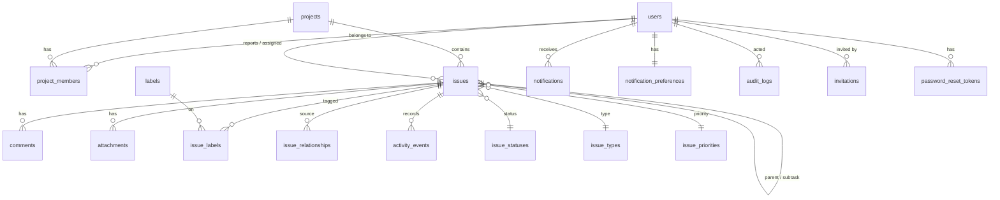

# Database

PostgreSQL 16, accessed via async SQLAlchemy 2. Schema changes are managed with
Alembic. Timestamps are stored as `TIMESTAMPTZ` (UTC).

## ER diagram



## Tables

| Table | Purpose |
|-------|---------|
| `users` | Accounts + global role, password hash, lockout state |
| `invitations` | Invite-only registration tokens (hashed) |
| `password_reset_tokens` | Single-use, expiring reset tokens (hashed) |
| `projects` | Projects, key, status, dates, per-project `issue_counter` |
| `project_members` | Membership + per-project role (manager/member) |
| `issue_statuses` / `issue_types` / `issue_priorities` | Workflow reference data (rows, not enums) |
| `issues` | Core work items; `parent_id` for subtasks; `(project_id, number)` unique |
| `issue_relationships` | Directed links (`blocks`, `relates_to`); no self / no dup |
| `labels` / `issue_labels` | Labels and their issue associations |
| `comments` | Issue comments (soft-deleted) |
| `attachments` | File metadata (bytes on disk, not in DB) |
| `activity_events` | User-facing, immutable issue/project history |
| `notifications` / `notification_preferences` | In-app notifications + per-user email prefs |
| `audit_logs` | Append-only security/admin trail |

## Key constraints

- `projects.key` unique; `issues.key` unique; `UNIQUE(project_id, number)`.
- `UNIQUE(project_id, user_id)` on `project_members`.
- `issue_relationships`: `UNIQUE(source, target, type)` + `CHECK(source <> target)`.
- Foreign keys use `ON DELETE CASCADE` for owned children and `SET NULL` for
  actor references so history survives user deletion (users are deactivated, not deleted).

## Indexes

Created on the hot query paths (see model definitions):
`issues(project_id, assignee_id, status_id, priority_id, due_date, created_at, updated_at, parent_id, key)`,
`comments(issue_id)`, `notifications(user_id, is_read)`,
`activity_events(issue_id, project_id, event_type)`,
`audit_logs(actor_id, action, created_at)`,
`project_members(project_id, user_id)`.

## Issue key generation

Issue keys (`DOC-124`) are allocated transactionally: the project row is locked
(`SELECT … FOR UPDATE`), `issue_counter` is incremented, and the number is used to
build the key — all inside the create-issue transaction. This is safe under
concurrent creation and guarantees no duplicate keys.

## Migrations

```bash
alembic upgrade head                              # apply
alembic revision --autogenerate -m "add X"        # generate from model changes
alembic downgrade -1                              # roll back one
```

The initial migration (`0001_initial`) bootstraps the full schema via
`metadata.create_all`. Later changes should be ordinary autogenerated migrations
that diff against that state. Never hand-edit a production database.

## Counting semantics (used consistently in code & dashboards)

- **Open** = status not in the `done` category and not archived.
- **Completed** = status in the `done` category.
- **Overdue** = `due_date < today` and not `done` and not archived
  (see `app/services/issue_rules.py`).
